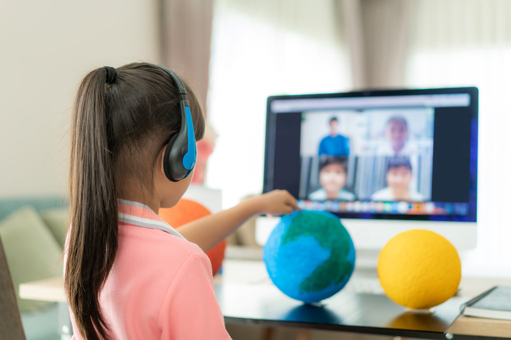

:::note

You can check out the [Original Article](http://yuram.tech/classrooms-without-borders-education-technology-revolutionizing-the-face-of-education/) here, on Yuram's website.

:::

Technology is continuously evolving and changing the way we communicate, work, play, and create. Therefore, it only makes sense that digital technology advancements would change the face of education as we know it. E-learning development is now a multi-billion dollar industry; 98% of US Businesses plan to adopt [EdTech in 2020](https://www.daxx.com/blog/development-trends/edtech-trends-elearning-development).

<!--truncate-->

## Education Technology (“EdTech”): The New Buzzword
Education technology, put in simple terms, is the effective use of technology in learning. If we expand on the previous definition, education technology is an area of technology devoted to developing and applying tools (software, hardware, and processes) to promote [education](https://onlinedegrees.sandiego.edu/what-is-educational-technology-definition-examples-impact/). Another important definition is, “EdTech is a study and ethical practice for facilitating learning and improving performance by creating, using, and managing appropriate technological processes and [resources](https://edtechreview.in/dictionary/119-what-is-edtech).” EdTech is not trying to replace the current practices educators and teachers are an integral part of education. EdTech is simply about the use of tools to aid and enhance the delivery of education. 

## What Types of EdTech are There?
There are three different main types of EdTech, and these are synchronous and asynchronous, linear learning, and collaborative learning. 

### Synchronous and Asynchronous
This type of Edtech is one that most if not many of us have become familiar with over the last year due to COVID-19. Learning occurs both inside and outside the classroom. Instructor-led learning is called synchronous learning. However, self-paced learning is asynchronous learning. 

**Synchronous learning** has to do with exchanging ideas and information with others at the same time. Some examples are face to face discussions, online teacher instructor and feedback sessions, Zoom or Skype conversations, or virtual classrooms (where the entire class is online and working collaboratively). Synchronized learning helps students become better listeners and develop more open/flexible minds. Synchronous learning develops students’ online awareness. Students must listen and eventually learn from their peers. 

**Asynchronous learning** means that students have the freedom to go through the content at their own pace. A student can replay a video lecture or take their time thinking about assignment questions in an online course. Additionally, one student going at a slower pace would not disrupt other students’ learning or hold the class back. Students also do so without fear of embarrassment. Asynchronous learning uses technology such as blogs, wikis, discussion boards, Google Docs, audio (such as podcasts), video courses, and social networking.

### Linear Learning
[Linear learning](https://www.e-spincorp.com/3-difference-types-of-educational-technology/) takes place through computer-based training (CBT). CBT refers to self-paced activities delivered on a computer or a handheld device such as smartphones or tablets. CBT initially had content through CDs and presented content in a linear manner, such as reading an online book. This is why CBT is used to teach a static process, such as using specific software or doing mathematical equations. CBT provides learning opportunities beyond the traditional modes of textbooks, manuals, or classroom-based instruction. 

### Collaborative Learning
As the name implies, computer-supported collaborative learning (CSCL) uses a teaching methodology that encourages or requires students to collaborate on learning tasks. 

## A World of Possibilities: Why Use EdTech ?
The [Millennials](https://edtechmagazine.com/k12/article/2006/10/millennials-education-relies-technology) are a unique generation; they never knew a world without technology. Therefore, Millenial’s attitude towards education is different from previous generations. Children arrive at school or even preschool with technology know-how. As educators and parents, we need to meet the current generation’s needs. So one of the main reasons that there is a global shift towards including EdTech is that students simply demand it. When new ideas, concepts, and subjects are introduced through tools that students are familiar with and have mastered, they will feel confident in their learning abilities. Additionally, they will feel engaged, and they might help their peers learn. The following section outlines some of the benefits of using technology in the classroom. 

Having technology in the classroom improves the learning experience. By using technology in class, teachers can make lessons more engaging for students. The possibilities are endless, from using artificial intelligence to [gamification](https://www.education.gov.au/national-stem-education-resources-toolkit/gamification) and polling software. Engaging students in class becomes active agents and not passive bystanders and ensures that students use high-level thinking skills. By having students become more engaged and being active agents in their learning, knowledge retention is improved. 

Using technology in the classroom encourages individual learning. Learners are different; they have different styles as well as distinct abilities. Technology caters to diverse learners and allows for flexibility. Students have the opportunity to go over the material as many times needed, and they can skip ahead of what they already know. 

Technology is specifically a game-changer for students with learning and developmental disabilities. [Assistive technology](https://www.pearson.com/us/higher-education/product/Dell-Assistive-Technology-in-the-Classroom-Enhancing-the-School-Experiences-of-Students-with-Disabilities-2nd-Edition/9780131390409.html) refers to “devices and services that are used to increase, maintain, or improve the capabilities of a student with a disability.” Assistive technology is used to support learning and to help students bypass difficult tasks such as handwriting. Assistive technology ranges from low to high tech.

## Stepping into the 21st Century
Using technology helps both students and teachers develop skills that are essential for the 21st century. Technology allows students to gain skills that will make them successful in the future. Learning today is about collaborating with others and accepting diverse and different backgrounds. It is now easier than ever to connect students in different countries and learn firsthand about diversity acceptance and different cultures. Modern learning and technology help students solve and attempt to solve complex problems; it teaches critical thinking, various forms of communication, and leadership skills. 

## Re-Imagining the Future
Teaching is a dynamic process, and as our students’ needs and interests continue to change, education and teachers should follow suit. Learning today does not have to be restricted to classrooms. EdTech has opened up limited possibilities, and we have seen that first hand throughout the COVID-19 outbreak. 