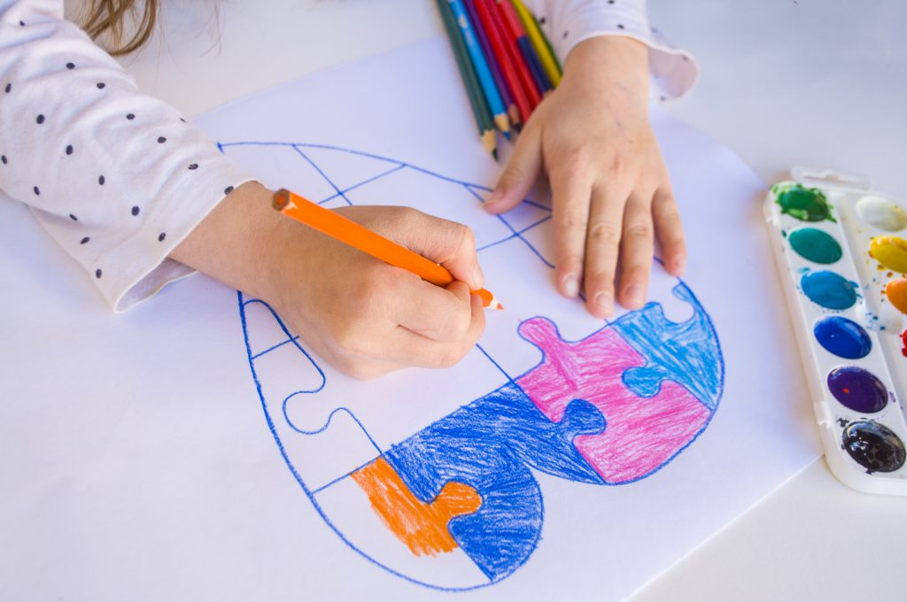

:::note

You can check out the [Original Article](http://yuram.tech/autism-spectrum-disorder/) here, on Yuram's website.

:::

The WHO estimates that one in [160 children](https://www.who.int/news-room/fact-sheets/detail/autism-spectrum-disorders) have an autism spectrum disorder (ASD). In 2020, the [CDC](https://www.cdc.gov/ncbddd/autism/facts.html) reported that one in 54 children in the US is diagnosed with an autism spectrum disorder (according to 2016 data). Moreover, one in 34 boys was identified with autism, while one in 144 girls are identified with autism. 

<!--truncate-->

## What is Autism Spectrum Disorder? 
Autism or autism spectrum disorder refers to a wide array of conditions characterized by [challenges](https://www.autismspeaks.org/what-autism) in social skills, communication, speech, nonverbal communication, and behavior. The disorder also includes limited and repetitive patterns of behavior. The term ‘spectrum’ in autism spectrum refers to the wide range of symptoms and severity. It is important to note that autism spectrum disorder now includes previously separate conditions. These conditions are autism, Asperger’s syndrome, childhood disintegrative disorder, and an unspecified form of pervasive developmental disorder. 

Since autism is a spectrum disorder, each person with autism has a different set of strengths and challenges. This means that how people with autism spectrum disorder learn differs from one person to another. 

## Types of Autism Spectrum Disorder
Until recently, people talked about different types of autism separately. The following disorders were considered separately autistic disorder, Asperger’s syndrome, [pervasive developmental disorder](https://www.webmd.com/brain/autism/development-disorder). However, as mentioned earlier, these conditions are now called autism spectrum disorders. Since many people still use the old terminology, it is essential to know what each term means. Since these conditions are all on a spectrum, we will start from the less severe end of the spectrum and move to the more severe end. 

**Asperger’s syndrome** is on the more mild end of the spectrum. An individual with Asperger’s may be very intelligent and can be able to manage their daily life. These individuals tend to struggle to interact socially and usually have a few facial expressions. However, individuals with Asperger’s tend to have excellent rote memory and [musical ability](https://www.medicinenet.com/asperger_syndrome/definition.htm). Nonetheless, individuals with Asperger’s become much interested and fixated on one or two subjects. They can become so interested in such topics that they exclude other subjects altogether. In addition to talking about a particular topic in length, they may repeat a specific word or phrase many times. 

The second term is [**pervasive developmental disorder**](https://www.webmd.com/brain/autism/autism-spectrum-disorders). This category includes children whose autism is more severe than Asperger’s; but not as severe as autistic disorder. The autistic disorder, an older term, is further along the spectrum than both Asperger’s and pervasive developmental disorder. However, its symptoms mimic those of Asperger’s, but they are exhibited more intensely. 

Lastly, [**childhood disintegrative disorder (CDD)**](https://www.britannica.com/science/childhood-disintegrative-disorder) or Heller syndrome is the rarest and most severe type, and it lies at the most severe part of the spectrum. It is a rare neurobiological disorder characterized by the deterioration of language and social skills and intellectual functioning loss. Moreover, this deterioration takes place following normal development, at least the initial two years of life. 

## What Causes Autism Spectrum Disorders? 
Research suggests that various factors can make a child more suspectable to autism spectrum disorders. These factors include both environmental and genetic factors. Research suggests that genetics are involved in the majority of cases. For some children, autism spectrum disorder can be associated with a genetic disorder such as [Rett syndrome](https://www.rettsyndrome.org/) or [fragile X](https://www.cdc.gov/ncbddd/fxs/facts.html) syndrome. While for other children, genetic changes or mutations might increase the risk for autism spectrum disorders. Some genetic mutations are inherited, while others happen spontaneously. Some of the environmental factors that play a role in children developing autism spectrum disorders are exposure during pregnancy to pollution and [pesticides](https://hub.jhu.edu/2017/02/27/autism-cause-treatment/). 

Children that are born to older parents tend to be more at risk for autism spectrum disorders. Moreover, parents who have one child with autism spectrum disorder have a [2 to 18 percent](https://www.autismspeaks.org/autism-statistics-asd) chance of having a second baby affected. Studies have shown that if one child has autism spectrum disorder among identical twins, then the other child will be affected about [36 to 95 percent](https://www.autismspeaks.org/autism-statistics-asd) of the time. Additionally, if one child is affected among nonidentical twins, then the other is affected 31 percent of the time.

In the past, there have been claims that there is a link between certain vaccination and autism spectrum disorder. However, according to the WHO, “Available [epidemiological](https://www.who.int/news-room/fact-sheets/detail/autism-spectrum-disorders) data are conclusive that there is no evidence of a causal association between measles, mumps and rubella vaccine, and ASD. Previous studies suggesting a causal link were found to be filled with methodological flaws.”

## There’s Still More Ground to Cover
There is still a lot that scientists do not know about autism spectrum disorders. Therefore, research is continuously ongoing; in 2016, autism spectrum disorder research amounted to more than [364.4 million](https://www.nbcnews.com/health/kids-health/cure-autism-not-so-fast-n1055921) US Dollars. 